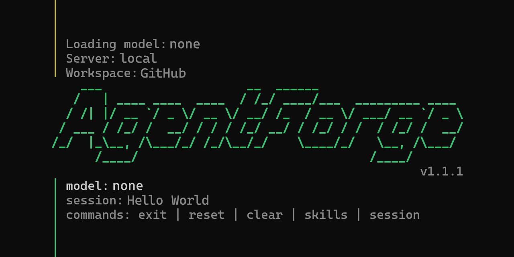

<p align="center">
  
</p>

# Agent-02

Agent-02 is a WebUI-first local agent runtime for Windows. It boots a FastAPI gateway, talks to `llama.cpp` router mode, and gives you one control surface at `http://127.0.0.1:18789/webchat`.

The supported runtime is now:

- `run.bat` -> boots Gateway + WebUI
- WebChat -> main operator surface
- channels -> `Telegram`, `Discord`, `Zalo`
- session storage -> `workspace/sessions/*.json`
- routing metadata -> `workspace/gateway/session_index.json`

Terminal UI is no longer part of the supported runtime.

## Quick Start

1. Install Python 3.10+ on Windows.
2. Keep the default sibling layout:

```text
D:\AI Agent\
|- Agent-02\
|- llama.cpp\llama-server.exe
`- models\*.gguf
```

3. Copy `run.local.bat.example` to `run.local.bat` if you need machine-specific overrides.
4. Double-click `run.bat`.

The launcher waits for `/health`, then opens `http://127.0.0.1:18789/webchat` unless `AUTO_OPEN_BROWSER=0`.
If an Agent-02 gateway is already running on the same host and port, the launcher reuses it instead of starting a second instance.

## What Starts

- Gateway: `127.0.0.1:18789`
- WebUI: [http://127.0.0.1:18789/webchat](http://127.0.0.1:18789/webchat)
- llama.cpp router: `127.0.0.1:8080`
- llama.cpp Web UI: [http://127.0.0.1:8080/](http://127.0.0.1:8080/)

Agent-02 reads models from `GET /v1/models`. If the router exposes one model, the session auto-selects it. If it exposes many, WebUI asks you to choose one before chat starts.

## WebUI Workflow

The WebUI is the control plane for everything:

- `Sessions`: inbox rail for WebChat and channel-backed sessions
- `Models`: choose the active model for the current logical session
- `Channels`: enable or configure Telegram, Discord, and Zalo
- `Pairing`: approve or reject DM pairing requests
- `Settings`: runtime health, backend state, and workspace path

The default WebChat session key is `agent:main:main`.

## Channel Parity Scope

This wave uses `D:\AI Agent\openclaw` as a behavior reference, but Agent-02 stays Python-native and does not embed the OpenClaw runtime.

Implemented in Agent-02:

- WebChat main session
- Telegram long-polling
- Discord gateway client
- Zalo long-polling
- DM pairing with `workspace/credentials/<channel>-pairing.json`
- fail-closed group and guild policy with `groupPolicy`, `groupAllowFrom`, and `requireMention`

Deferred for later:

- multi-account channels
- Discord threads
- Telegram topics
- plugin runtime
- voice, canvas, and mobile pairing flows

## Config and Secrets

Gateway config lives in `workspace/gateway/config.json`.

Secret resolution order:

1. token stored in `workspace/gateway/config.json`
2. environment fallback

Supported env fallbacks:

- `TELEGRAM_BOT_TOKEN`
- `DISCORD_BOT_TOKEN`
- `ZALO_BOT_TOKEN`

Public admin endpoints never echo channel secrets back to the UI.

Inference defaults are intentionally low-friction:

- `REASONING_EFFORT` is blank by default
- `MAX_REQUESTS_PER_MINUTE=0` disables the LLM-side request cap

## Docs

- [Tutorial (EN)](docs/TUTORIAL_EN.md)
- [Tutorial (VI)](docs/TUTORIAL_VI.md)
- [Blueprint (EN)](docs/BLUEPRINT_EN.md)
- [Blueprint (VI)](docs/BLUEPRINT_VI.md)

## Validation

```powershell
python -m pytest -q
python -m compileall -q src
$env:PYTHONPATH='src'; python -m agentforge.cli --help
$env:PYTHONPATH='src'; python -m agentforge.cli gateway --help
```

## Notes

- `run.bat` intentionally stays CRLF for `cmd.exe` compatibility.
- Binding Gateway to a non-loopback address requires `--allow-remote-admin` or `ALLOW_REMOTE_ADMIN=1`.
- Historical transcripts in `workspace/sessions` are preserved as-is and may still contain older conversation text.
