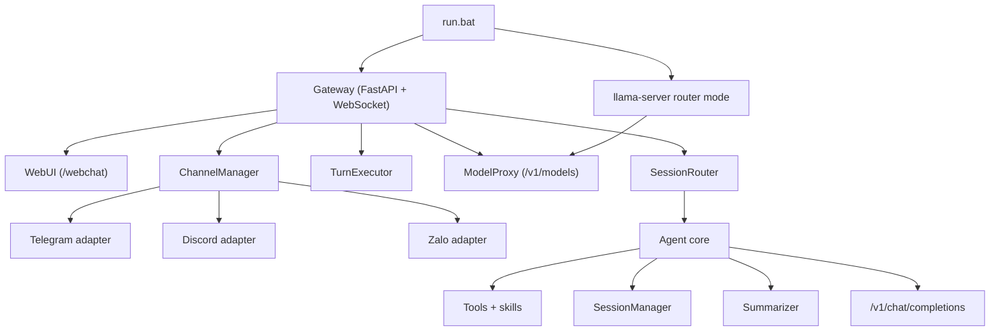

# Agent-02 Blueprint (EN)

## 1. Overview

Agent-02 is a WebUI-first gateway runtime built around three ideas:

- keep the Python agent core, tools, skills, and transcript format
- let `llama.cpp` router mode be the only model source of truth
- move operator control into WebUI instead of a terminal shell

`D:\AI Agent\openclaw` is used as a behavior and naming reference for channels, pairing, and routing, but Agent-02 stays a standalone Python implementation.

## 2. Architecture



## 3. Launcher and Runtime Flow

Default launcher flow:

1. `run.bat` resolves environment overrides.
2. missing dependencies are installed if needed.
3. `llama-server` starts in router mode on `127.0.0.1:8080`.
4. Gateway starts on `127.0.0.1:18789`.
5. the launcher waits for `/health`.
6. the browser opens `/webchat` unless auto-open is disabled.

Runtime defaults favor fast first-token behavior:

- no forced `reasoning_effort`
- no LLM request-per-minute cap unless explicitly configured

If an Agent-02 gateway is already listening on the target port, the launcher reuses it instead of starting a duplicate process.

Terminal UI is removed from the supported runtime. `agentforge run` remains only as a deprecated alias to `agentforge gateway run`.

## 4. Session and Routing Model

Transcript persistence:

- `workspace/sessions/<session_id>.json`

Logical session index:

- `workspace/gateway/session_index.json`

Each session entry stores:

- `session_key`
- `session_id`
- `channel`
- `peer_type`
- `peer_id`
- `account_id`
- `last_route`
- `selected_model_id`
- `created_at`
- `updated_at`

Routing keys in this wave:

- WebChat and approved DMs: `agent:main:main`
- Telegram and Zalo groups: `agent:main:<channel>:group:<id>`
- Discord guild channels: `agent:main:discord:channel:<id>`

`reset` rotates `session_id` but preserves the logical route and session key.

## 5. WebUI Surface

HTTP:

- `GET /health`
- `GET /api/models`
- `GET /api/sessions`
- `GET /api/sessions/{session_key}/transcript`
- `GET /api/admin/channels`
- `PUT /api/admin/channels/{channel}`
- `POST /api/admin/channels/{channel}/probe`
- `GET /api/admin/pairing`
- `POST /api/admin/pairing/{channel}/{code}/approve`
- `POST /api/admin/pairing/{channel}/{code}/reject`
- `DELETE /api/admin/pairing/{channel}/{sender_id}`
- `GET /webchat`

WebSocket:

- `hello`
- `session.attach`
- `session.list`
- `chat.submit`
- `session.reset`
- `models.list`
- `session.model.set`
- `ping`

Streaming server events:

- `session.snapshot`
- `models.snapshot`
- `assistant.delta`
- `assistant.reasoning`
- `tool.call.start`
- `tool.call.delta`
- `tool.call.end`
- `tool.result`
- `status`
- `assistant.done`
- `error`

## 6. Channel Framework

Built-in channels:

- Telegram via Bot API long-polling
- Discord via `discord.py`
- Zalo via Bot API long-polling

Canonical config path:

- `workspace/gateway/config.json`

Supported channel config fields:

- `enabled`
- `dmPolicy`
- `allowFrom`
- `groupPolicy`
- `groupAllowFrom`
- `requireMention`
- `groups` or `guilds`

Secret resolution order:

1. config file
2. environment fallback

Environment fallback names:

- `TELEGRAM_BOT_TOKEN`
- `DISCORD_BOT_TOKEN`
- `ZALO_BOT_TOKEN`

## 7. Pairing and Access Policy

Defaults:

- DM: `dmPolicy=pairing`
- groups and guilds: fail-closed `groupPolicy=allowlist`
- groups and guilds: `requireMention=true`

Pairing store:

- `workspace/credentials/<channel>-pairing.json`
- `workspace/credentials/<channel>-allowFrom.json`

Design intent:

- DM approvals stay DM-only
- group authorization never inherits pairing approvals
- WebUI is the approval surface for pairing

## 8. Model Management

Agent-02 does not maintain a model registry.

Source of truth:

- `llama-server` router mode
- `GET /v1/models`

Behavior:

- one model -> auto-select
- multiple models -> block chat until model selection
- zero models -> return a setup error to WebUI or external channel

## 9. OpenClaw Parity Snapshot

Implemented in this wave:

- WebChat session rail and control dock
- Telegram, Discord, and Zalo channel adapters
- DM pairing
- fail-closed group and guild gating
- deterministic reply routing

Not implemented yet:

- multi-account channels
- Discord threads
- Telegram topics
- plugin runtime
- voice mode
- canvas and mobile pairing

## 10. Validation

```powershell
python -m pytest -q
python -m compileall -q src
$env:PYTHONPATH='src'; python -m agentforge.cli --help
$env:PYTHONPATH='src'; python -m agentforge.cli gateway --help
```
