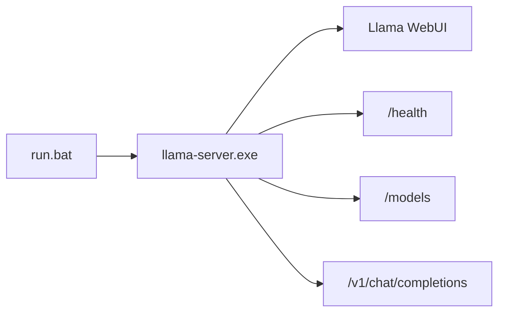

# Blueprint

## Current Runtime

Agent-02 currently has one runtime surface only:

## Ownership Rules

`llama-server` owns:
- model selection
- chat completions
- streaming
- attachments
- conversation UX
- llama WebUI

Agent-02 must not currently own:
- a duplicate WebUI
- a custom chat submit protocol
- a custom session model for chat
- a model selection layer on top of llama
- a gateway that sits between browser chat and llama

## Supported Product Surface

Supported now:
- Windows launcher via `run.bat`
- local llama-server boot
- llama WebUI as the default UI

Not supported now:
- custom Agent-02 browser UI
- custom Agent-02 admin API
- custom Agent-02 chat/session orchestration

## Workspace State

The workspace remains as a future rebuild anchor.

Current bootstrap files:
- `IDENTITY.md`
- `SOUL.md`
- `AGENT.md`
- `USER.md`

These files are preserved, but no rebuilt autonomy runtime is wired to them yet.

## Build Rule For Future Work

Any future feature must pass this test first:

1. Does standalone llama already handle it?
2. If yes, Agent-02 must not duplicate it.
3. If no, it belongs in the product diff roadmap.

## Roadmap Anchor

Future implementation work must start from `docs/TODO_RUNTIME_DIFF.md`.
