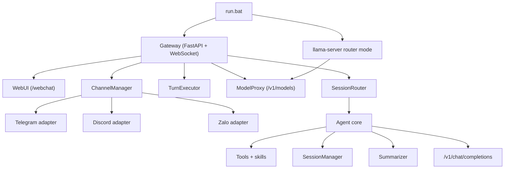

# Agent-02 Blueprint (VI)

## 1. Tong quan

Agent-02 la runtime gateway theo huong WebUI-first, xoay quanh 3 y tuong:

- giu nguyen Python agent core, tools, skills va transcript format
- de `llama.cpp` router mode lam nguon su that duy nhat cho model
- dua toan bo thao tac van hanh sang WebUI thay vi terminal shell

`D:\AI Agent\openclaw` duoc dung lam repo tham chieu cho naming va behavior cua channel, pairing va routing, nhung Agent-02 van la implementation Python doc lap.

## 2. Kien truc



## 3. Luong khoi dong va runtime

Luong mac dinh:

1. `run.bat` doc env override.
2. tu cai dependency neu thieu.
3. khoi dong `llama-server` o `127.0.0.1:8080`.
4. khoi dong Gateway o `127.0.0.1:18789`.
5. doi `/health`.
6. mo `/webchat` neu auto-open dang bat.

Mac dinh runtime uu tien first-token nhanh:

- khong ep `reasoning_effort`
- khong bat gioi han request-per-minute cho LLM neu khong cau hinh

Neu da co Agent-02 dang lang nghe tren port dich, launcher se reuse instance do thay vi khoi dong process trung lap.

Terminal UI da bi loai khoi runtime duoc ho tro. `agentforge run` chi con la alias deprecate tro sang `agentforge gateway run`.

## 4. Session va routing

Transcript:

- `workspace/sessions/<session_id>.json`

Chi muc logical session:

- `workspace/gateway/session_index.json`

Moi entry luu:

- `session_key`
- `session_id`
- `channel`
- `peer_type`
- `peer_id`
- `account_id`
- `last_route`
- `selected_model_id`
- `created_at`
- `updated_at`

Khoa routing trong wave nay:

- WebChat va DM da approve: `agent:main:main`
- Telegram va Zalo group: `agent:main:<channel>:group:<id>`
- Discord guild channel: `agent:main:discord:channel:<id>`

`reset` se doi `session_id` nhung giu nguyen logical route.

## 5. Be mat WebUI

HTTP:

- `GET /health`
- `GET /api/models`
- `GET /api/sessions`
- `GET /api/sessions/{session_key}/transcript`
- `GET /api/admin/channels`
- `PUT /api/admin/channels/{channel}`
- `POST /api/admin/channels/{channel}/probe`
- `GET /api/admin/pairing`
- `POST /api/admin/pairing/{channel}/{code}/approve`
- `POST /api/admin/pairing/{channel}/{code}/reject`
- `DELETE /api/admin/pairing/{channel}/{sender_id}`
- `GET /webchat`

WebSocket:

- `hello`
- `session.attach`
- `session.list`
- `chat.submit`
- `session.reset`
- `models.list`
- `session.model.set`
- `ping`

Event stream tu server:

- `session.snapshot`
- `models.snapshot`
- `assistant.delta`
- `assistant.reasoning`
- `tool.call.start`
- `tool.call.delta`
- `tool.call.end`
- `tool.result`
- `status`
- `assistant.done`
- `error`

## 6. Framework channel

Channel built-in:

- Telegram qua Bot API long-polling
- Discord qua `discord.py`
- Zalo qua Bot API long-polling

Config chuan:

- `workspace/gateway/config.json`

Field duoc ho tro:

- `enabled`
- `dmPolicy`
- `allowFrom`
- `groupPolicy`
- `groupAllowFrom`
- `requireMention`
- `groups` hoac `guilds`

Thu tu resolve secret:

1. config file
2. env fallback

Ten env fallback:

- `TELEGRAM_BOT_TOKEN`
- `DISCORD_BOT_TOKEN`
- `ZALO_BOT_TOKEN`

## 7. Pairing va chinh sach truy cap

Mac dinh:

- DM: `dmPolicy=pairing`
- group va guild: fail-closed `groupPolicy=allowlist`
- group va guild: `requireMention=true`

File pairing:

- `workspace/credentials/<channel>-pairing.json`
- `workspace/credentials/<channel>-allowFrom.json`

Nguyen tac:

- pairing approval cua DM chi dung cho DM
- group auth khong duoc ke thua tu pairing
- WebUI la noi approve pairing

## 8. Quan ly model

Agent-02 khong tao model registry rieng.

Nguon su that:

- `llama-server` router mode
- `GET /v1/models`

Behavior:

- 1 model -> tu chon
- nhieu model -> chan chat toi khi chon
- 0 model -> tra setup error ve WebUI hoac channel ben ngoai

## 9. Parity so voi OpenClaw

Da co trong wave nay:

- WebChat voi session rail va control dock
- adapter Telegram, Discord, Zalo
- DM pairing
- fail-closed group va guild gating
- deterministic reply routing

Chua co:

- multi-account
- Discord thread
- Telegram topic
- plugin runtime
- voice mode
- canvas va mobile pairing

## 10. Kiem tra

```powershell
python -m pytest -q
python -m compileall -q src
$env:PYTHONPATH='src'; python -m agentforge.cli --help
$env:PYTHONPATH='src'; python -m agentforge.cli gateway --help
```
