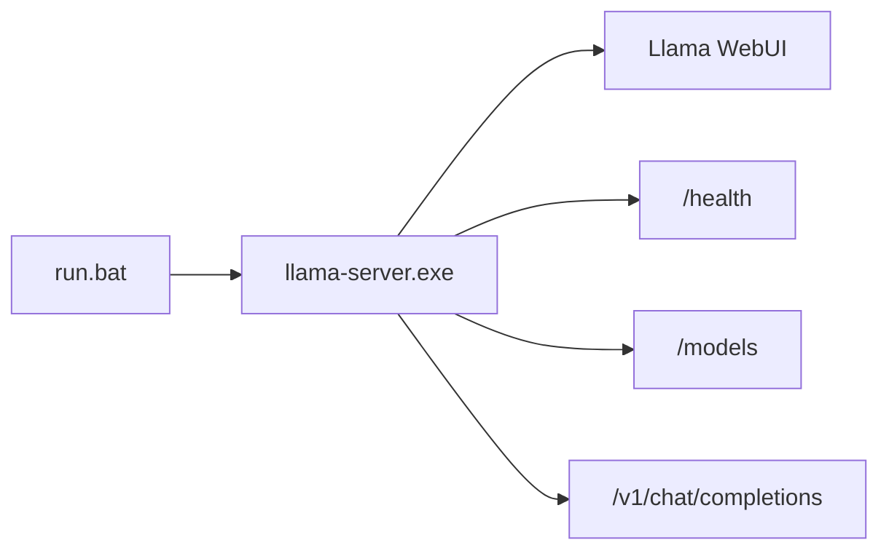

# Blueprint

## Runtime Hien Tai

Agent-02 hien tai chi con mot be mat runtime:

## Quy Tac Ownership

`llama-server` so huu:
- chon model
- chat completions
- streaming
- attachments
- conversation UX
- llama WebUI

Agent-02 hien tai khong duoc so huu:
- WebUI bi duplicate
- protocol chat submit rieng
- session model rieng cho chat
- lop chon model de len tren llama
- gateway dung giua browser chat va llama

## Be Mat Ho Tro

Dang ho tro:
- launcher Windows qua `run.bat`
- khoi dong local llama-server
- llama WebUI la UI mac dinh

Chua ho tro:
- browser UI rieng cua Agent-02
- admin API rieng cua Agent-02
- chat/session orchestration rieng cua Agent-02

## Workspace

Workspace duoc giu lai lam neo cho cac wave rebuild sau.

Bo file bootstrap hien tai:
- `IDENTITY.md`
- `SOUL.md`
- `AGENT.md`
- `USER.md`

Cac file nay duoc giu lai, nhung chua co autonomy runtime moi nao duoc noi vao.

## Luat Build Ve Sau

Moi tinh nang moi deu phai qua bai test nay:

1. Standalone llama da lam duoc chua?
2. Neu roi, Agent-02 khong duoc duplicate.
3. Neu chua, tinh nang do moi nam trong roadmap phan diff.

## Roadmap Anchor

Moi cong viec implement ve sau phai bat dau tu `docs/TODO_RUNTIME_DIFF.md`.
